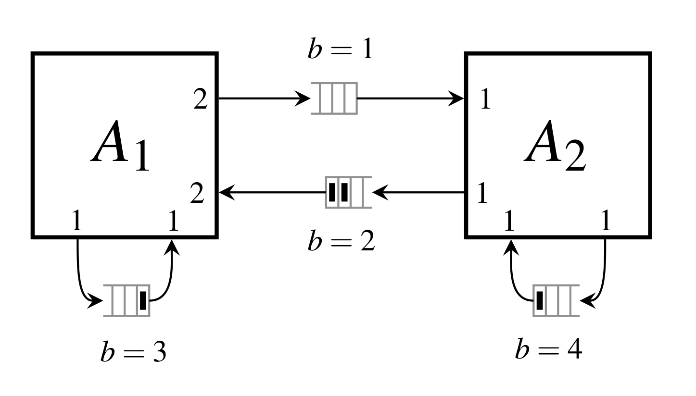

# Introduction and Goals

The main goal of this repository is to demonstrate the results of research conducted in [(Glumac 2022)](#glumac2022). The research introduced the use of a synchronous data flow ([(Lee 1987)](#lee1987)) as a computational model for non-iterative co-simulation masters [(Kübler 2000)](#kubler2000). The analysis of the co-simulation quality is based on the numerical defect analysis [(Enright 2000)](#enright2000). Co-simulation quality estimates are used to automatically configure a co-simulation network.

## Requirements Overview

A co-simulation network consists of Functional Mock-up Units [(blochwitz2000)](#blochwitz2000). The repository demonstrates how to automatically configure and simulate a co-simulation network for a given tolerance.

## Quality Goals

1. Verifiability (of the conclusions of the thesis) - The conclusions of the thesis should be easily verified with the code in the repository.
2. Extensibility (for the future research) - There should be an easy way to test additional hypotheses related to the research described.

The code is **not designed for**
* Performance - The code is intended to verify the research results. The target model of the calculation is fixed and the results should be the same for less CPU intensive code. This decision allows the use of Python.

# System Scope and Context

## Business Context

## Technical Context

The software is written as the Python package sdf4sim available from [PyPI](https://pypi.org/project/sdf4sim/).

# Building Block View

## Class Relationship Diagram

# Runtime View

## *sdf4sim.sdf.sequential_run*

The procedure calculates a sequential schedule for the SDF graph and runs it. It is used to implement
* *sdf4sim.cs.execute_until*
* and subsequently *sdf4sim.cs.execute*

## \<Runtime Scenario 2> {#__runtime_scenario_2}

## ... {#_}

## \<Runtime Scenario n> {#__runtime_scenario_n}

# Deployment View {#section-deployment-view}

## Infrastructure Level 1 {#_infrastructure_level_1}

***\<Overview Diagram>***

Motivation

:   *\<explanation in text form>*

Quality and/or Performance Features

:   *\<explanation in text form>*

Mapping of Building Blocks to Infrastructure

:   *\<description of the mapping>*

## Infrastructure Level 2 {#_infrastructure_level_2}

### *\<Infrastructure Element 1>* {#__emphasis_infrastructure_element_1_emphasis}

*\<diagram + explanation>*

### *\<Infrastructure Element 2>* {#__emphasis_infrastructure_element_2_emphasis}

*\<diagram + explanation>*

...

### *\<Infrastructure Element n>* {#__emphasis_infrastructure_element_n_emphasis}

*\<diagram + explanation>*

# Cross-cutting Concepts {#section-concepts}

## *\<Concept 1>* {#__emphasis_concept_1_emphasis}

*\<explanation>*

## *\<Concept 2>* {#__emphasis_concept_2_emphasis}

*\<explanation>*

...

## *\<Concept n>* {#__emphasis_concept_n_emphasis}

*\<explanation>*

# Architecture Decisions {#section-design-decisions}

# Quality Requirements {#section-quality-scenarios}

## Quality Tree {#_quality_tree}

## Quality Scenarios {#_quality_scenarios}

# Risks and Technical Debts {#section-technical-risks}

# Glossary {#section-glossary}

+-----------------------+-----------------------------------------------+
| Term                  | Definition                                    |
+=======================+===============================================+
| *\<Term-1>*           | *\<definition-1>*                             |
+-----------------------+-----------------------------------------------+
| *\<Term-2>*           | *\<definition-2>*                             |
+-----------------------+-----------------------------------------------+

# References

<a id="glumac2022">(Glumac 2022)</a> 
Glumac, Slaven. "Automated configuring of non-iterative co-simulation modeled by synchronous data flow." PhD diss., University of Zagreb. Faculty of Electrical Engineering and Computing. Department of Control and Computer Engineering, 2022.

<a id="lee1987">(Lee 1987)</a> 
Lee, Edward A., and David G. Messerschmitt. "Synchronous data flow." Proceedings of the IEEE 75, no. 9 (1987): 1235-1245.

<a id="kubler2000">(Kübler 2000)</a> 
Kübler, Ralf, and Werner Schiehlen. "Two methods of simulator coupling." Mathematical and computer modelling of dynamical systems 6, no. 2 (2000): 93-113.

<a id="enright2000">(Enright 2000)</a> 
Enright, W. H. "Continuous numerical methods for ODEs with defect control." Journal of computational and applied mathematics 125, no. 1-2 (2000): 159-170.

<a id="blochwitz2000">(Blochwitz 2000)</a> 
Blochwitz, Torsten, Martin Otter, Martin Arnold, Constanze Bausch, Christoph Clauß, Hilding Elmqvist, Andreas Junghanns et al. "The functional mockup interface for tool independent exchange of simulation models." In Proceedings of the 8th international Modelica conference, pp. 105-114. Linköping University Press, 2011.

# 

This documentation is based on the modification of the arc42 template. Some of the content suggested by the original template is not displayed.

**About arc42**

arc42, the template for documentation of software and system
architecture.

Template Version 8.1 EN. (based upon AsciiDoc version), May 2022

Created, maintained and © by Dr. Peter Hruschka, Dr. Gernot Starke and
contributors. See <https://arc42.org>.
